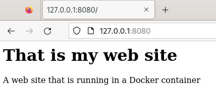
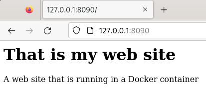
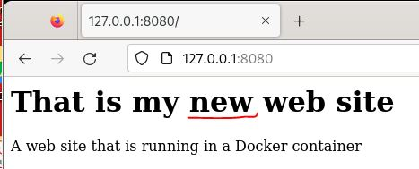

### Exercice

1.	Create the folder `www`

```yaml
$ mkdir www
```

2.	Move into the folder `www` and create a `index.html`. 

```yaml
$ cd www
$ touch index.html
```

3.	Edit the file `index.html` with some texts.

```yaml
nano index.html
<h1>That is my web site </h1>
<p>A web site that is running in a Docker container</p>
```

4. Download and run the **httpd (apache)** image. Name the container `my-web-site`, use the port `8080` and use the variable `"$PWD":/usr/local/apache2/htdocs` to create a **Bindmount volume** on the container local folder `httpd:2.4`.

```yaml
$ docker run -dit --name my-web-site -p 8080:80 -v "$PWD":/usr/local/apache2/htdocs httpd:2.4
```

5.Open a browser and test the website using: **http://127.0.0.1:8080**



6. Create another **httpd** container using the same Bindmount volume `"$PWD”` and the port `8090`.

```yaml
$   docker run -dit --name my-web-site1 -p 8090:80 -v "$PWD":/usr/local/apache2/htdocs/ httpd:2.4
```

7. Open a browser and test the website using: **http://127.0.0.1:8090**



8. Edit the file `index.html` and check if the content of both websites is changed automatically.

```yaml
nano index.html
<h1>That is my NEW web site </h1>
<p>A web site that is running in a Docker container</p>
```


