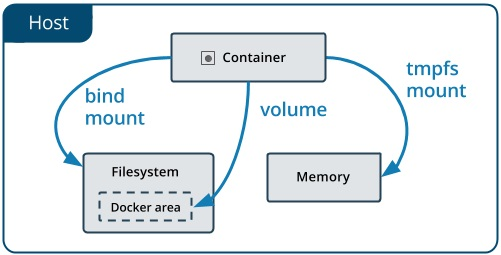
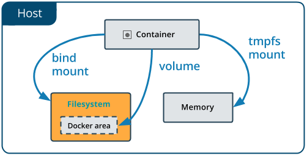
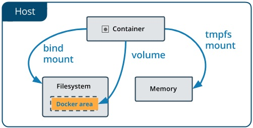

Docker containers runs your applications, those applications need data and that data need to be stored some where.  You as a docker administrator need to know manage docker storage and volumes.

## Manage data in Docker

By default all files created inside a container are stored on a writable container layer, but data should not be stored inside the container! because  there are some issues with that  :

* Containers are designed to be ephemeral \(disposable\)
* When containers are stopped, data is not accessible.
* Containers are typically stored on each host
* The container file system wasn't designed for high performance I/O.

 Docker has two options for containers to store files in the host machine, so that the files are persisted even after the container stops: _**volumes**_, and _**bind mounts**_. 

>Info: If you’re running Docker on Linux you can also use a _tmpfs mount_. If you’re running Docker on Windows you can also use a _named pipe_.

1. **Bind Mount**: have limited functionality and you must use the exact file path on the host.
2. **Named Volumes** : The recommended way to persist data, stored at `/var/lib/docker/volumes/`
3. **Anonymous mount**: Volumes created without a specified name, used to persist data generated by a container.
4. **tmpfs mount**: Stored only in a host's memory in Linux.



### 1-Bind  mounts

Bind mounts are one of the types of volumes you can use in Docker to share data between your host system and your containers. They allow you to mount a specific directory or file from the host filesystem into a container.

The file or directory does not need to exist on the Docker host. 
Bind mounts are very performant, but they rely on the host machine’s filesystem having a specific directory structure available. 



```yaml
[root@earth]# mkdir /work
[root@earth]# cd /work 
[root@earth]# touch code_source.txt
[root@earth]#  ls 
code_source.txt

[root@earth]#  docker run -it -v /work:/work ubuntu
root@b853101f43ba:/# cd /work
root@b853101f43ba:/work# ls
code_source.txt
root@b853101f43ba:/work# touch code_source2.txt
root@b853101f43ba:/work# ls
code_source.txt  code_source2.txt
root@b853101f43ba:/work# exit

[root@earth]# docker run -it -v /work:/work2 ubuntu
root@384d1066473a:/# cd /work2
root@384d1066473a:/work2# ls
code_source.txt  code_source2.txt
root@384d1066473a:/work2# exit

[root@earth]# ls
code_source2.txt  code_source.txt
```

### 2- Named Volumes

Named Volumes are the preferred mechanism for persisting data generated by and used by Docker containers. While bind mounts are dependent on the directory structure of the host machine, volumes are completely managed by Docker. Volumes have several advantages over bind mounts:

* Volumes are easier to back up or migrate than bind mounts.
* Volumes work on both Linux and Windows containers.
* Volumes can be more safely shared among multiple containers.
* Volume drivers let you store volumes on remote hosts or cloud providers, to encrypt the contents of volumes, or to add other functionality.



#### Create a volume:

```yaml
[root@earth]# docker volume create my-vol
my-vol
```

#### List volumes:

```yaml
[root@earth]# docker volume ls
DRIVER              VOLUME NAME
local               8137730e7356621d3075c51b80c7838fd987b0ac34f586c035cf66eb2a9af6ed
local               my-vol
```

Note: Get more information about a volume by using `docker volume inspect my-vol` command.

#### Remove a volume

```yaml
[root@earth]# docker volume rm my-vol
```

#### Start a container with a volume

```yaml
[root@earth]# docker run -it -v database:/work/database_ubuntu
root@5be4d50f3878:/# cd /work/database/
root@5be4d50f3878:/work/database# touch file1.txt
root@5be4d50f3878:/work/database# ls
file1.txt
root@5be4d50f3878:/work/database#exit 

From another Shell terminal:
[root@earth]# docker volume ls
[root@earth]# docker run -it -v database:/work/database ubuntu
root@816a69c04145:/# cd /work/database/
root@816a69c04145:/work/database# ls
file1.txt
root@816a69c04145:/work/database# exit
```
### 3- Anonymous Volumes

Aanonymous volumes are volumes that are created by Docker and are not explicitly named by the user. They are useful for persisting data between container restarts, ensuring that certain data is not lost when the container is stopped or removed. Here’s a detailed explanation:

```yaml
[root@earth]# docker run -it -v /data/work ubuntu
root@816a69c04145:/# exit

From another Shell terminal:
[root@earth]# docker volume ls
[root@earth]# docker volume rm <ID_Volume_Anonymous>
```

Ressources:

[https://docs.docker.com/storage/storagedriver/select-storage-driver/](https://docs.docker.com/storage/storagedriver/select-storage-driver/)

[https://docs.docker.com/storage/volumes/](https://docs.docker.com/storage/volumes/)

[https://docs.docker.com/storage/bind-mounts/](https://docs.docker.com/storage/bind-mounts/)
