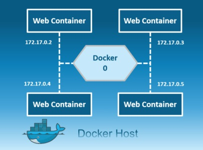
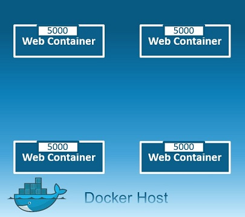
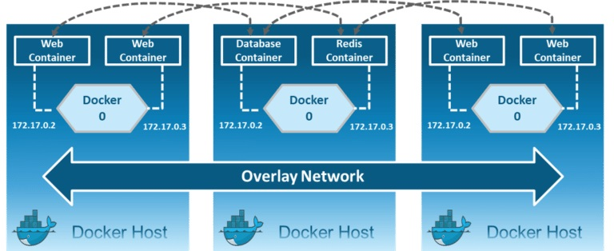
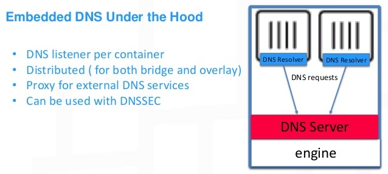
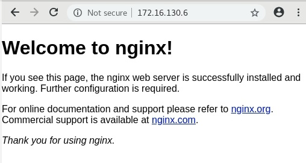

**https://docs.docker.com/network/**

Individual containers, need to  communicate with each other through a network to perform the required actions, and this is nothing but Docker Networking.

You can define Docker Networking as a communication passage through which all the isolated containers communicate with each other in various situations to perform the required actions.

### **Docker Network Drivers**

There are mainly **6 network drivers: Bridge, Host, None, Overlay, IPvlan and Macvlan:**

 **Bridge:** The bridge network is a _**private default internal network**_ created by docker on the host. So, all containers get an internal IP address and these containers can access each other, using this internal IP. The Bridge networks are usually used when your applications run in standalone containers that need to communicate.



> Note : The Docker server creates and configures the host system’s **docker0** interface as an **Ethernet bridge** inside the Linux kernel that could be used by the docker containers to **communicate with each other and with the outside world**, the default configuration of the **docker0** works for most of the scenarios but you could customize the **docker0** bridge based on your specific requirements.

> The **docker0** **bridge** is virtual interface created by docker, it randomly chooses an address and subnet from the private range defined by RFC 1918 that are not in use on the host machine, and assigns it to **docker0**. All the docker containers will be connected to the **docker0** bridge by default, the docker containers connnected to the **docker0** bridge could use the iptables NAT rules created by docker to communicate with the outside world.

**Host**: This driver removes the network isolation between the docker host and the docker containers to use the host’s networking directly. So with this, you will not be able to run multiple web containers on the same host, on the same port as the port is now common to all containers in the host network.



 **Macvlan:** Allows you to assign a MAC address to a container, making it appear as a physical device on your network. Then, the Docker daemon routes traffic to containers by their MAC addresses. Macvlan driver is the best choice when you are expected to be directly connected to the physical network, rather than routed through the Docker host’s network stack.


 **IPvlan:** Gives users total control over both IPv4 and IPv6 addressing. The VLAN driver builds on top of that in giving operators complete control of layer 2 VLAN tagging and even IPvlan L3 routing for users interested in underlay network integration.
 


 **Overlay**: Creates an internal private network that spans across all the nodes participating in the swarm cluster. So, Overlay networks facilitate communication between a swarm service and a standalone container, or between two standalone containers on different Docker Daemons.



**None**: In this kind of network, containers are not attached to any network and do not have any access to the external network or other containers. So, this network is used when you want to completely disable the networking stack on a container and, only create a loopback device.


Lets wrap it up:

|Bridge|Host|Overlay|IPvlan|Macvlan|None|
|---|---|---|---|---|---|
|Connects container to the LAN and other containers|Remove network isolation between container and host|Connects multiple Docker hosts and their containers together and enable swarm|Associated to a Linux Ethernet interface|Assign a MAC address, appear as physical host|Connects the container to an isolated network with only that container on it|
|The default network type|Only one container can use a port at the same time|Only available with Docker EE and Swarm enabled.|Enforce separation between networks and connectivity to the physical network.|Clones host interfaces to create virtual interfaces, available in the container.|Container cannot communicate with any other networks or networked devices.|
|Great for most use cases|Useful for specific applications, such as management container that you want to run on every host|Multihost networking using VXLAN|Offers a number of unique features and plenty of room for further innovations with the various modes..|Supports connecting to VLANs|

### Listing Docker Networks

```yaml
[root@earth ~]# docker network ls
NETWORK ID          NAME                DRIVER              SCOPE
b05ff920f0da        bridge              bridge              local
f34113b7dc6a        host                host                local
ba9b9833188b        none                null                local
```

As we are using Docker-CE there is no Overlay network. We can get detailed information about any of these networks using `docker network inspect`  command.

### Creating a bridge network

```yaml
[root@earth ~]# docker network create --driver bridge --subnet=192.168.1.0/24 --gateway=192.168.1.1 myapp-net
4c7a97493cf3b2c151966afa5a933859ba6b246862f1d05ac9030d9aaa4d70ac
```

```yaml
[root@earth ~]# docker network ls
NETWORK ID          NAME                DRIVER              SCOPE
b05ff920f0da        bridge              bridge              local
f34113b7dc6a        host                host                local
4c7a97493cf3        myapp-net           bridge              local
ba9b9833188b        none                null                local
```

so again we can user `docker network inspect myapp-net` to see details such as network subnet.

### Running container\(s\) on the bridge network

```yaml
[root@earth ~]# docker run -it --name app1 --network myapp-net alpine 
Unable to find image 'alpine:latest' locally
latest: Pulling from library/alpine
df20fa9351a1: Pull complete 
Digest: sha256:185518070891758909c9f839cf4ca393ee977ac378609f700f60a771a2dfe321
Status: Downloaded newer image for alpine:latest
2ca2b7353e439a27390d363237ba166e9bb9f957748ec01455a3f17a4fc14afa
[root@earth ~]# / # ip ad
...
7: eth0@if8: <BROADCAST,MULTICAST,UP,LOWER_UP,M-DOWN> mtu 1500 qdisc noqueue state UP 
    link/ether 02:42:c0:a8:01:02 brd ff:ff:ff:ff:ff:ff
    inet 192.168.1.2/24 brd 192.168.1.255 scope global eth0
       valid_lft forever preferred_lft forever
```

use `docker network inspect myapp-net` in order to check the container\(s\) that are running on the myapp-net network, see the ip address.

Lets bring up another container app2 on myapp-net and check the communications between two containers:

```yaml
[root@earth ~]# docker run -it --name app2 --network myapp-net alpine 
c353a85a7c70ff125815f817335abb98ebffa82f595878d20074aee8ed837f74
/ # ip ad
...
9: eth0@if10: <BROADCAST,MULTICAST,UP,LOWER_UP,M-DOWN> mtu 1500 qdisc noqueue state UP 
    link/ether 02:42:c0:a8:01:03 brd ff:ff:ff:ff:ff:ff
    inet 192.168.1.3/24 brd 192.168.1.255 scope global eth0
       valid_lft forever preferred_lft forever

```

```yaml
[root@earth ~]# docker network inspect myapp-net
.
.
.
 "Containers": {
            "2ca2b7353e439a27390d363237ba166e9bb9f957748ec01455a3f17a4fc14afa": {
                "Name": "app1",
                "EndpointID": "edfcfafd5da16efe1524ce744f8dae3cec57dc7cf6e80aa922e7b28d5bcebb2a",
                "MacAddress": "02:42:ac:12:00:02",
                "IPv4Address": "192.168.1.2/24",
                "IPv6Address": ""
            },
            "c353a85a7c70ff125815f817335abb98ebffa82f595878d20074aee8ed837f74": {
                "Name": "app2",
                "EndpointID": "a2e0b13be62ae9813ed3d70d423f32031b57a3cef30eec78598684f0459cbfdd",
                "MacAddress": "02:42:ac:12:00:03",
                "IPv4Address": "192.168.1.3/24",
                "IPv6Address": ""
            }
        },
        "Options": {},
        "Labels": {}
    }
```

- From app1 ping app2 :

```yaml
/ # ping 192.168.1.3
PING 192.168.1.3 (192.168.1.3): 56 data bytes
64 bytes from 192.168.1.3: seq=0 ttl=64 time=0.191 ms
64 bytes from 192.168.1.3: seq=1 ttl=64 time=0.057 ms
64 bytes from 192.168.1.3: seq=2 ttl=64 time=0.142 ms
^C
--- 192.168.1.3 ping statistics ---
3 packets transmitted, 3 packets received, 0% packet loss
round-trip min/avg/max = 0.057/0.130/0.191 ms
/ # 
/ # ping app2
PING app2 (192.168.1.3): 56 data bytes
64 bytes from 192.168.1.3: seq=0 ttl=64 time=0.087 ms
64 bytes from 192.168.1.3: seq=1 ttl=64 time=0.103 ms
64 bytes from 192.168.1.3: seq=2 ttl=64 time=0.132 ms
^C
--- app2 ping statistics ---
3 packets transmitted, 3 packets received, 0% packet loss
round-trip min/avg/max = 0.087/0.107/0.132 ms
/ # 
/ # 
```

### Docker Embeded DNS

Containers can reach each other using their names

All containers in a docker host can resolve each other with the name of the container, docker has a built in DNS server that helps the containers to resolve each other using the container name. Built in DNS server always run at address 127.0.0.11.



As there is no guarantee that containers get the same ip when system reboots, using the container's name it the right way of calling other apps inside other containers.

### Configuring DNS

 By default, a container inherits the DNS settings of the host, as defined in the `/etc/resolv.conf` configuration file. Containers that use the default `bridge` network get a copy of this file, whereas containers that use a custom network use Docker’s embedded DNS server, which forwards external DNS lookups to the DNS servers configured on the host.

If we want a container to use specific DNS server we have  a couple of different ways to go about this:

**1. Using `--dns` flag  while run a container:**

```yaml
[root@earth ~]# cat /etc/resolv.conf
# Generated by NetworkManager
search localdomain
nameserver 192.168.181.2

[root@earth ~]# docker run -it --name alpine1 --dns 8.8.8.8 alpine
[/]# cat /etc/resolv.conf 
nameserver 8.8.8.8
[ /]# exit

### Removing a docker network

```yaml
[root@earth ~]# docker network remove myapp-net
Error response from daemon: error while removing network: network myapp-net id 4c7a97493cf3b2c151966afa5a933859ba6b246862f1d05ac9030d9aaa4d70ac has active endpoints
```

before removing a network we have to make sure there are no running container on that network so first:

```yaml
[root@earth ~]# docker container  stop app1 app2
app1
app2
```

```yaml
[root@earth ~]# docker network remove myapp-net
myapp-net
[root@earth ~]# docker network ls
NETWORK ID          NAME                DRIVER              SCOPE
b05ff920f0da        bridge              bridge              local
f34113b7dc6a        host                host                local
ba9b9833188b        none                null                local
```

 **`docker network prune`** will remove all unused networks.


### Creating a host network

The concept of **host network** is very simple, instead of a container running and then having some  sort of network address translation that you may or may not configure between the host and  the container\(s\) , with host network the container runs and it is utilizing the physical interface of the host network. So no NAT, no port to configure, that container is directly on host physical network.

```yaml
[root@earth ~]# docker container run -d --network host nginx
50d79130ab8cd8e96758756b7920b64d4675be262cc1e2250c7b06c066fdd07f

[root@earth ~]# docker ps
CONTAINER ID   IMAGE      COMMAND                  CREATED          STATUS         PORTS    NAMES
50d79130ab8c   nginx      "nginx -g 'daemon of…"   5 seconds ago    Up 4 seconds            determined_leavitt          
```

and actually there are not private to public port mapping, it is directly on the host network:

```yaml
[root@earth ~]# docker container port <container_name>
```

 open a web browser and go to your **docker host ip address**:



```yaml
[root@earth ~]# docker network ls
NETWORK ID     NAME        DRIVER    SCOPE
81dfee2cc1a8   bridge      bridge    local
24ca579cac93   host        host      local
5534e991653d   none        null      local

[root@earth ~]# docker network inspect host 
    {
        "Name": "host",
        "Id": "24ca579cac936f740ef433ec9a2ff52798003db38790dab8492676d4eec0a05f",
        "Created": "2024-01-24T16:35:47.156057512-05:00",
        "Scope": "local",
        "Driver": "host",
...
[root@earth ~]# docker network rm host
Error response from daemon: host is a pre-defined network and cannot be removed
```
---
Ressources:

[https://vsupalov.com/docker-expose-ports/](https://vsupalov.com/docker-expose-ports/)

[https://docs.docker.com/config/containers/container-networking/](https://docs.docker.com/config/containers/container-networking/)


