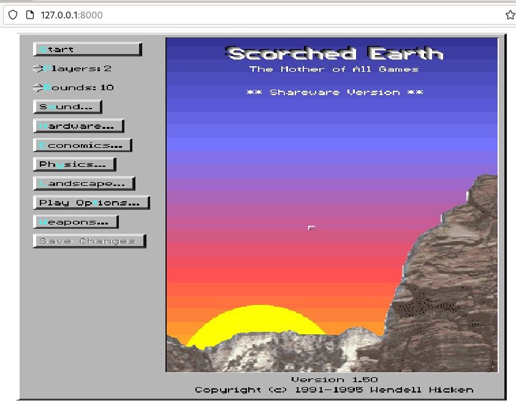

### Solution - Creating an image from a Dockerfile

#### Preparation

```yaml
$ mkdir dos
$ cd dos
$ vim index.html

<html>
  <style type="text/css" media="screen">
      canvas {
          width: 800px; 
          height: 600px;
      }
  </style>
  <head>
    <title>DOS Game!</title>
    <script src="js-dos.js"></script>
  </head>
  <body>
    <canvas id="jsdos" width="800" height="600" ></canvas>
    <script>
      Dos(document.getElementById("jsdos"), {
      }).ready((fs, main) => {
        fs.extract("game.zip").then(() => {
          main(["-c", GAME_ARGS])
        });
      });
    </script>
  </body>
</html>
```

#### Dockerfile

```yaml
$ vim dockerfile

# Image Base
FROM node:16-alpine
   
# Working Directory
WORKDIR /site
   
# Installing JS-DOS Files
RUN wget https://js-dos.com/6.22/current/js-dos.js && \
    wget https://js-dos.com/6.22/current/wdosbox.js && \
    wget https://js-dos.com/6.22/current/wdosbox.wasm.js
   
# Installing serve
RUN npm install -g serve
   
# Set a variable
ARG GAME_URL
   
# Adding a game
RUN wget -O game.zip "$GAME_URL"
   
# Game Configuration
ARG GAME_ARGS
COPY index.html ./index.html
RUN sed -i "s|GAME_ARGS|$GAME_ARGS|g" index.html
   
# Launching the game server
ENTRYPOINT ["npx","serve","-l","tcp://0.0.0.0:8000"]
```

#### Image creation

```yaml
$ docker build --build-arg GAME_URL=https://archive.org/download/msdos_festival_SCORCH15/SCORCH15.ZIP --build-arg GAME_ARGS=\"SCORCH.EXE\" -t mycool:dosgame .
```

#### Container creation 

```yaml 
$ docker run --rm -p 8000:8000 mycool:dosgame
```

#### Container test




