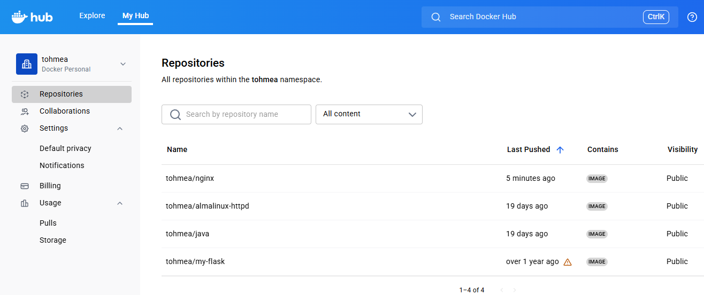

## What is a Docker Image?

An image is an executable package that includes everything needed to run an application: the code, a runtime environment, libraries, environment variables, and configuration files.

> A container is a runtime instance of an image.


---

### Understanding the Concept of Layers with Docker Images

- **Multiple containers** are generally based on the **same image.**
- Images consist of **multiple read-only layers.** 
- When a container starts, **Docker adds a new writable layer on top of the image.**
- This **writable layer is deleted when the container is deleted.**
- Layers are **shared among containers** to save disk space.
- Each container starts as if it has a fresh copy of the image, **without actually copying it.**

#### Why No Copies?

- Container images **can be very large**, such as the Anaconda Python image which is around 1.5 GB.
- Making a copy would be both **a waste of disk space and very slow.**
- Docker therefore does not make copies; instead, it uses a **layering technique called `Overlay filesystem`.**

#### How Does the Overlay File System (OverlayFS) Work?

**`OverlayFS`** mounts a file system using two directories: a **`lower directory`** and an **`upper directory`**.

- **`lower directory`** for the **read-only** image.
- **`upper directory`** for the container's **read/write** layer.
- They are presented merged together as a single directory called **merged**.

The following diagram illustrates how a Docker image and a Docker container are structured in layers:


- `file1` and `file3` are unmodified, so they remain in `lowerdir`.
- `file2` has been modified (copied up from `lowerdir`).
- `file4` exists in `upperdir` because it was created directly inside the container.

---

### Storage Location of Docker Images and Containers

A Docker container consists of network settings, volumes, and images. The storage location of Docker files depends on your operating system:

* Linux: `/var/lib/docker/`
* Windows: `C:\ProgramData\DockerDesktop`
* MacOS: `~/Library/Containers/com.docker.docker/Data/vms/0/`

Use the `docker info | grep Root` command to locate it on your host system:

```console
[root@earth]# docker info | grep Root
Docker Root Dir: /var/lib/docker
```

---

### Searching for an Image

Whether using a public or private registry, you can search for the image you need using the `docker search` command:

```yaml
docker search [OPTIONS] TERM
```

`docker search` offers useful filtering options. You can filter results using conditions such as:

* **stars=_Number_of_stars_**
* **is-automated=\(true\|false\)**
* **is-official=\(true\|false\)**

```console
[root@earth]# docker search --filter "stars=90" --filter "is-official=true" ubuntu
NAME                DESCRIPTION                                     STARS               OFFICIAL            AUTOMATED
ubuntu              Ubuntu is a Debian-based Linux operating sys…   11152               [OK]                
ubuntu-upstart      Upstart is an event-based replacement for th…   110                 [OK]
```

---

### Listing Local Images

To list locally available images, use the following command:

```console
[root@earth]# docker image ls
REPOSITORY          TAG                 IMAGE ID            CREATED             SIZE
<none>              <none>              fc32da11d651        About a minute ago   233MB
redis               latest              50541622f4f1        4 days ago           104MB
ubuntu              latest              adafef2e596e        2 weeks ago          73.9MB
nginx               latest              9beeba249f3e        2 months ago         127MB
hello-world         latest              bf756fb1ae65        6 months ago         13.3kB
```

The image we recently built appears on the first line. It was not tagged during the build process; image tagging is covered in detail below.

---

### Downloading an Image from the Default Registry

To download a specific image or set of image layers, use `docker pull`:

```yaml
docker pull <image name>
```

```console
[root@earth]# docker pull python
Using default tag: latest
latest: Pulling from library/python
15b1d8a5ff03: Already exists 
22718812f617: Pull complete 
401a98f7495b: Pull complete 
ad446e7df19a: Pull complete 
5d32990caa16: Pull complete 
a79d633abf9a: Pull complete 
249a56c8e466: Pull complete 
Digest: sha256:2deb0891ec3f643b1d342f04cc22154e6b6a76b41044791b537093fae00b6884
Status: Downloaded newer image for python:latest
docker.io/library/python:latest
```

> **Note:** As mentioned, Docker images can consist of multiple layers. In the example above, the Python image **contains six layers.**

---

### Removing One or More Specific Images

Use `docker images` or `docker image ls` to locate the IDs or tags of the images you wish to delete, then run `docker rmi`:

```yaml
docker rmi <image1> <image2>
```

```console
[root@earth]# docker rmi ubuntu
Untagged: ubuntu:latest
Untagged: ubuntu@sha256:9cbed754112939e914291337b5e554b07ad7c392491dba6daf25eef1332a22e8
Deleted: sha256:802541663949fbd5bbd8f35045af10005f51885164e798e2ee8d1dc39ed8888d
Deleted: sha256:9d592720ced4a7a4ddf16adef8a126e4c8c49f22114de769343320b37674321e
```

> You cannot remove an image being referenced by a stopped container unless you use the **`-f`** (force) flag.

```console
[root@earth]# docker rmi python:latest 
Error response from daemon: conflict: unable to remove repository reference "python:latest" (must force) - container 88347b61e797 is using its referenced image 77f2b24be2b3

[root@earth]# docker ps -a
CONTAINER ID    IMAGE           COMMAND     CREATED         STATUS                    PORTS     NAMES
88347b61e797    python:latest   "python3"   56 seconds ago  Exited (0)55 seconds ago            python1

[root@earth]# docker rmi -f python:latest
Untagged: python:latest
Untagged: python@sha256:2deb0891ec3f643b1d342f04cc22154e6b6a76b41044791b537093fae00b6884
Deleted: sha256:77f2b24be2b3987f6d59918787d226acb4e6612644bacb3dd37adc494e477d9e
```

---

### Tagging Images

- In simple terms, Docker tags add useful versioning or variant information to an image.
- They act as **`aliases`** pointing to an image ID.

The two most common use cases for tagging are:

1. **During Image Build:**

```yaml
docker build -t image_name:tag_name .
```

This instructs the Docker daemon to read the Dockerfile in the current working directory (`.`) and tag the resulting image with the specified name and tag.

2. **Using the `docker tag` Command:**

```yaml
docker tag SOURCE_IMAGE[:TAG] TARGET_IMAGE[:TAG]
```

This creates an alias (a pointer reference) named `TARGET_IMAGE` pointing directly to `SOURCE_IMAGE`.

```console
[root@earth]# docker image ls
REPOSITORY          TAG                 IMAGE ID            CREATED             SIZE
python              latest              45fd9a3ce5de        13 days ago         1.11GB
ubuntu              latest              adafef2e596e        2 weeks ago         73.9MB
nginx               latest              9beeba249f3e        2 months ago        127MB

[root@earth]# docker tag python:latest python:original
[root@earth]# docker image ls
REPOSITORY          TAG                 IMAGE ID            CREATED             SIZE
python              original            45fd9a3ce5de        13 days ago         1.11GB
ubuntu              latest              adafef2e596e        2 weeks ago         73.9MB
nginx               latest              9beeba249f3e        2 months ago        127MB
```

If no tag is specified during tagging or pulling, Docker automatically defaults to **`:latest`**.

---

### Committing Container Changes to an Image

When working with Docker containers, a fundamental feature is the ability to commit container modifications into a new Docker image. When you commit changes, you create a new image layer containing the modifications made on top of the base layer.

```yaml
docker commit [OPTIONS] CONTAINER [REPOSITORY[:TAG]]
```

For example, let's run a container based on the `nginx` image:

```console
[root@earth]# docker run -d -p 8080:80 --name nginx1 nginx
63c8886ceb5cce637348a75fd3deaeee36d8deb67bd327d58657f8133f557689
```

Next, let's attach to the running container shell and modify `index.html`:

```console
[root@earth]# docker exec -it nginx1 bash
root@5b0dbe546af1:/# cd /usr/share/nginx/html/
root@5b0dbe546af1:/usr/share/nginx/html# ls
50x.html    index.html
root@5b0dbe546af1:/usr/share/nginx/html# echo "<h1>NGINX Antoine Tohme</h1>" > index.html
root@5b0dbe546af1:/usr/share/nginx/html# exit
```

Now create a new image from this running container using **`docker commit`**:

```console
[root@earth]# docker commit nginx1 tohmea/nginx:1.0
sha256:39bf0253324e0e814660de517556ba5287f840a98fabf2a46db3420b55416c8d
```

> **Note:** Here `tohmea` is used because it represents a valid **Docker Hub** username.

Verify the new image:

```console
[root@earth]# docker image ls
REPOSITORY          TAG         IMAGE ID        CREATED         SIZE
tohmea/nginx        1.0         39bf0253324e    7 seconds ago   54MB
```

---

### Publishing Images to a Docker Registry

A **Docker Registry** is a stateless, highly scalable service that stores and distributes Docker images. Registries can be hosted locally (private) or in the cloud (public or private).

Examples of Docker Registries: **Docker Hub** (Default Registry).

Before pushing to a registry, you must authenticate using `docker login`:

> You must first create an account on Docker Hub.

```yaml
[root@earth]# docker login -u tohmea

i Info → A Personal Access Token (PAT) can be used instead.
         To create a PAT, visit https://app.docker.com/settings
         
Password: 

WARNING! Your credentials are stored unencrypted in '/root/.docker/config.json'.
Configure a credential helper to remove this warning. See
https://docs.docker.com/go/credential-store/

Login Succeeded
```

Use `docker push` to upload an image or repository to the registry:

```yaml
docker push [OPTIONS] NAME[:TAG]
```

Example:

```yaml
# Publish image to Docker Hub
[root@earth]# docker push tohmea/nginx:1.0
The push refers to repository [docker.io/tohmea/nginx]
7a5cd363b2aa: Preparing 
45c2d10807fb: Preparing 
129b375526fc: Preparing 
a0e5983a25a5: Preparing 
2988603ca264: Preparing 
39bc11fab520: Waiting 
dab69e9f41e9: Waiting 
eb5f13bce993: Waiting 
1.0: digest: sha256:a6ebce1476484145a4d280d915ce18c0e0b5d6d60fbf1fd324bdc5d5f75b278e size: 1985
```



When finished, log out:

```yaml
[root@earth]# docker logout
Removing login credentials for https://index.docker.io/v1/
```

---

### Saving and Restoring Images

To **save** a Docker image locally as a `.tar` archive file after downloading, committing, or building it, use the **`docker save`** command. For example, let's create a local tar archive of `tohmea/nginx`:

```yaml
# Save image to a .tar file
[root@earth]# docker save tohmea/nginx > tohmea-nginx.tar
[root@earth]# ls
tohmea-nginx.tar
```

To **restore** this Docker image from the archived tarball later, use the **`docker load`** command:

```yaml
# Remove local image to test restoration
[root@earth]# docker rmi tohmea/nginx:1.0
[root@earth]# docker image ls

# Restore image from .tar archive file
[root@earth]# docker load --input tohmea-nginx.tar  
Loaded image: tohmea/nginx:1.0
[root@earth]# docker image ls
REPOSITORY        TAG        IMAGE ID        CREATED         SIZE
tohmea/nginx      1.0        e3c264db09c0    10 minutes ago  192MB
...
```

---

### References

* https://docs.docker.com/storage/storagedriver/overlayfs-driver/
* https://www.digitalocean.com/community/tutorials/how-to-remove-docker-images-containers-and-volumes


