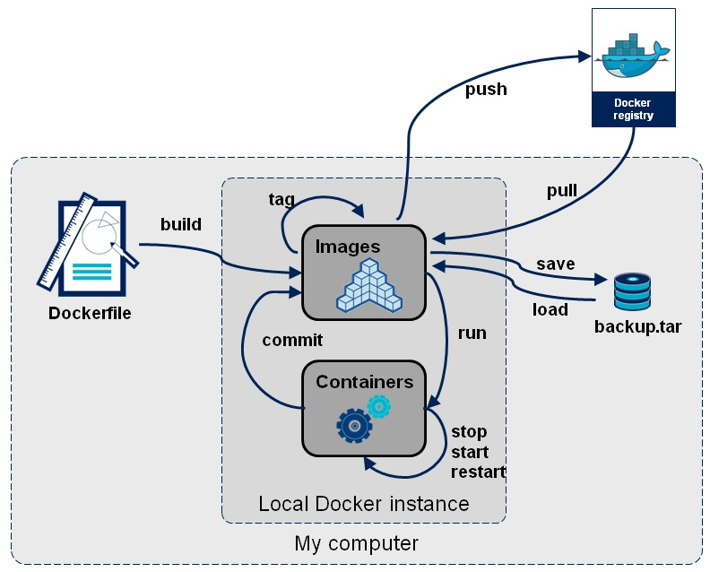
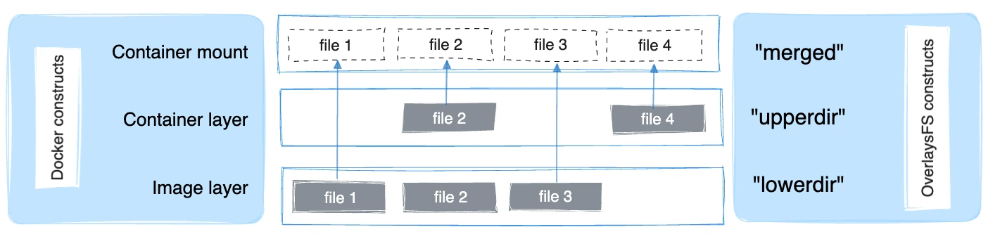

## What's a docker image?

An image is an executable package that includes everything needed to run an application: The code, a runtime, libraries, environment, variables, and configuration file.

> A container is a runtime instance of an image.



### Understanding Layering with Docker Images

- **Multiple containers** are typically based on the **same image.**
- Images are made up of **multiple read-only layers**. 
- When a container starts, **Docker adds a new writable layer on top of the image**.
- This writable **layer is removed when the container is deleted.**
- Layers are **shared across containers** to save disk space.
- Each container starts as if it has a fresh copy of the image, **but without actually copying it.**

#### Why no copies?

- Container images **can be pretty big**, like Anaconda Python distribution image which is about 1.5G.
- Making a copy would be both a **waste of disk space and pretty slow.**
- So Docker doesn’t make copies, instead it uses **layering technique called `Overlay filesystem`**.

#### How Overlay filesystem (OverlayerFS) work?

**`OverlayFS`** mount a filesystem using two directories: a **`lower directory`** and an **`upper directory`**.

- **`lower directory`** for the image **read-only**.
- **`upper directory`** for the container layer **read/write**.
- You see them merged together as if it’s one folder called **merged**.

The following diagram shows how a Docker image and a Docker container are layered. 



- `file1` and `file3` are unmodified, so they remain in lowerdir.
- `file2` was modified (copy-up from lowerdir).
- `file4` exist in upperdir because is created directly in the container.

### The storage location of Docker images and containers <a id="the-storage-location-of-docker-images-and-containers"></a>

A Docker container consists of network settings, volumes, and images. The location of Docker files depends on your operating system. Here is an overview for the most used operating systems:

* Ubuntu: `/var/lib/docker/`
* Fedora: `/var/lib/docker/`
* Debian: `/var/lib/docker/`
* Windows: `C:\ProgramData\DockerDesktop`
* MacOS: `~/Library/Containers/com.docker.docker/Data/vms/0/`

use `docker info | grep -i root` command to findout:

```console
[root@earth]# docker info | grep Root
Docker Root Dir: /var/lib/docker
```

### Searching for an image

Whether you are using a public or a private registry you can search that registry to find the image that you need. And that is what `docker search` command does for us:

```yaml
docker search [OPTIONS] TERM
```

`docker search` has a very useful filtering options, you can filter output based on these conditions:

* **stars=<NumberOfStar>**
* **is-automated=\(true\|false\)**
* **is-official=\(true\|false\)**

```console
[root@earth]# docker search --filter "stars=90" --filter "is-official=true" ubuntu
NAME                DESCRIPTION                                     STARS               OFFICIAL            AUTOMATED
ubuntu              Ubuntu is a Debian-based Linux operating sys…   11152               [OK]                
ubuntu-upstart      Upstart is an event-based replacement for th…   110                 [OK]
```

### Listing images

For listing local images, use the following syntax:

```console
[root@earth]# docker image ls
REPOSITORY          TAG                 IMAGE ID            CREATED              SIZE
<none>              <none>              fc32da11d651        About a minute ago   233MB
redis               latest              50541622f4f1        4 days ago           104MB
ubuntu              latest              adafef2e596e        2 weeks ago          73.9MB
nginx               latest              9beeba249f3e        2 months ago         127MB
hello-world         latest              bf756fb1ae65        6 months ago         13.3kB
```

The image we have recently built is showing up in the first line. We haven't tagged out image during build process ,we will talk about tagging images later in this section.

### Pulling an image from default registry

To download a particular image, or set of images, use `docker pull :`

```yaml
docker pull <image name>
```

```console
[root@earth]# docker pull debian
Using default tag: latest
latest: Pulling from library/debian
31dd5ebca5ef: Pull complete 
Digest: sha256:68f4e2259032a4e6f5035804e64438b52af8dd5889528b305b9059183ea4cd2a
Status: Downloaded newer image for debian:latest
```

As we mentioned Docker images can consist of multiple layers. In the example above, the image consists of two layers;

### Remove one or more specific images

Use the `docker images` command to locate the ID of the images you want to remove. When you’ve located the images you want to delete, you can pass their ID or tag to `docker rmi`:

```yaml
docker rmi <image1> <image2>
```

```console
[root@earth]# docker rmi debian
Untagged: debian:latest
Untagged: debian@sha256:68f4e2259032a4e6f5035804e64438b52af8dd5889528b305b9059183ea4cd2a
Deleted: sha256:ae8514941ea4f23d4948150debf0f92a427c136aa4e7fb85f9c56bba09452572
Deleted: sha256:6086e1b289d997dfd19df1ec9366541c49f5545520f9dc65ebd4cd64071497b4
```

> You can not remove an image which is used by a stop container, you can use `--force` for removing that but the stopped container\(s\) will be removed too!

```console
[root@earth]# docker ps -a | grep "hello-world"
c41d97e86738        hello-world         "/hello"                 4 days ago          Exited (0) 4 days ago                         flamboyant_allen

[root@earth]# docker rmi --force  hello-world
Untagged: hello-world:latest
Untagged: hello-world@sha256:49a1c8800c94df04e9658809b006fd8a686cab8028d33cfba2cc049724254202
Deleted: sha256:bf756fb1ae65adf866bd8c456593cd24beb6a0a061dedf42b26a993176745f6b

[root@earth]# docker ps -a | grep "hello-world"
```

### Tagging images

- In simple words, Docker tags adds useful information about a specific image version/variant. 
- They are aliases to the ID of your image which often look like this: `f1477ec11d12`. 
- It’s just a way of referring to your image. 

The two most common cases where tags come into play are:

1. When building an image, we use the following command:

```yaml
docker build -t image_name:tag_name .
```

It tells the Docker daemon to fetch the Docker file present in the current directory (that’s what the `.` at the end does). Next, we tell the Docker daemon to build the image and give it the specified tag.

2. Explicitly tagging an image through the `tag` command:

```yaml
docker tag SOURCE_IMAGE[:TAG] TARGET_IMAGE[:TAG]
```

It just creates an alias (a reference) by the name of the `TARGET_IMAGE` that refers to the `SOURCE_IMAGE.` That’s all it does. It’s like assigning an existing image another name to refer to it. Notice how the tag is specified as optional here as well, by the `[:TAG]` :

```yaml
[root@earth]# docker tag  myapp:final myapp:original
[root@earth]# docker image ls
REPOSITORY          TAG                 IMAGE ID            CREATED             SIZE
borosan/myapp       final               fc32da11d651        28 minutes ago      233MB
myapp               final               fc32da11d651        28 minutes ago      233MB
myapp               original            fc32da11d651        28 minutes ago      233MB
redis               latest              50541622f4f1        4 days ago          104MB
ubuntu              latest              adafef2e596e        2 weeks ago         73.9MB
nginx               latest              9beeba249f3e        2 months ago        127MB
hello-world         latest              bf756fb1ae65        6 months ago        13.3kB
```

> #### What happens when you don’t specify a tag? <a id="what-happens-when-you-don-t-specify-a-tag"></a>
>
>Whenever an image is tagged without an explicit tag, it’s given the `latest` tag by default. It’s an unfortunate naming choice that causes a lot of confusion. But I like to think of it as the **default tag** that’s given to images when you don’t specify one.

### Commiting changes to an image

When working with Docker images and containers, one of the basic features is committing changes to a Docker image. When you commit to changes, you essentially create a new image with an additional layer that modifies the base image layer.

```yaml
docker commit [OPTIONS] CONTAINER [REPOSITORY[:TAG]]
```

For example let run a container based on `atohme/nginx-alpine` image :

```yaml
[root@earth]# docker run -d -p 8080:80 --name nginx1 atohme/nginx-alpine
bc741086bb8bd8375ff03f14c699927e9659560ab6e653fe614f68843c6e4859
```

Now lets attach to it and modify `index.html`:

```yaml
[root@earth]# docker exec -i -t nginx1 /bin/sh
/ # cd /usr/share/nginx/html/
/usr/share/nginx/html # ls
50x.html    index.html
/usr/share/nginx/html # echo "<h1>MY-NGINX</h1>" > index.html
/usr/share/nginx/html # exit

```

Lets creating a new image from this running container using commit command:

```yaml
[root@earth]# docker commit nginx1 atohme/nginx-alpine:3.0
sha256:39bf0253324e0e814660de517556ba5287f840a98fabf2a46db3420b55416c8d
```

and see the result:

```yaml
[root@earth]# docker image ls
REPOSITORY            TAG       IMAGE ID       CREATED         SIZE
atohme/nginx-alpine   3.0       39bf0253324e   7 seconds ago   54MB
```

### Storing images in Docker Registry

A docker registery is a stateless, highly scalable application that stores and lets you distribute Docker images. Registries could be local \(private\) or cloud-base \(private or public\).

Examples of Docker Registries:

1. Docker Registry (local open-source registry)
2. Docker Trusted Registry\(DTR\) \[Available in Docker Enterprise Edition\]
3. Docker Hub \[Default Registry\]

The first thing to remember is any time you are going to use a registry you need to first log in to that registry:

>You need to create an account in Docker Hub first.

```yaml
[root@earth]# docker login
Login with your Docker ID to push and pull images from Docker Hub. If you don't have a Docker ID, head over to https://hub.docker.com to create one.
Username: borosan
Password: 
WARNING! Your password will be stored unencrypted in /root/.docker/config.json.
Configure a credential helper to remove this warning. See
https://docs.docker.com/engine/reference/commandline/login/#credentials-store

Login Succeeded
```

If we had a docker local registry then it would be `docker login localhost:5000` .

and when you finish your job , logout:

```yaml
[root@earth]# docker logout
Removing login credentials for https://index.docker.io/v1/
[root@earth]#
```

### Pushing an image to the Default Registery

Use docker push to Push an image or a repository to a registry

```yaml
docker push [OPTIONS] NAME[:TAG]
```

```yaml
[root@earth]# docker image ls
REPOSITORY          TAG                 IMAGE ID            CREATED             SIZE
borosan/myapp       final               fc32da11d651        2 hours ago         233MB
myapp               final               fc32da11d651        2 hours ago         233MB
myapp               original            fc32da11d651        2 hours ago         233MB
redis               latest              50541622f4f1        4 days ago          104MB
ubuntu              latest              adafef2e596e        2 weeks ago         73.9MB
nginx               latest              9beeba249f3e        2 months ago        127MB
hello-world         latest              bf756fb1ae65        6 months ago        13.3kB

[root@earth]# docker login
Login with your Docker ID to push and pull images from Docker Hub. If you don't have a Docker ID, head over to https://hub.docker.com to create one.
Username: itmt
Password: 
WARNING! Your password will be stored unencrypted in /root/.docker/config.json.
Configure a credential helper to remove this warning. See
https://docs.docker.com/engine/reference/commandline/login/#credentials-store
Login Succeeded

[root@earth]# docker push borosan/myapp:final 
The push refers to repository [docker.io/borosan/myapp]
3f8b89a55ad4: Pushed 
544a70a875fc: Pushed 
cf0f3facc4a3: Pushed 
132bcd1e0eb5: Pushed 
d22cfd6a8b16: Pushed 
final: digest: sha256:c8fcece97935d8babb195f4ab3c9be38a091e259c5e750b84151a48351192fa0 size: 1364

[root@earth]# docker logout
```
### Saving and exporting images

Pushing to Docker Hub is great, but it does have some disadvantages:

1. Bandwidth - many ISPs have much lower upload bandwidth than download bandwidth.
2. Unless you’re paying extra for the private repositories, pushing equals publishing.
3. When working on some clusters, each time you launch a job that uses a Docker container it pulls the container from Docker Hub, and if you are running many jobs, this can be really slow.

>Docker supports two different types of methods for saving container images to a single tarball:
>
>* **`docker save`** - Saves a non-running container _image_ to a file. It exports the entire image including its history and metadata, making it suitable for transferring Docker images between machines or environments.
>* **`docker export`** - Saves a container’s running or paused _instance_ to a file. It exports only the current state of a container’s filesystem, without the history or metadata of the image it was created from, making it suitable for backup purposes or for creating a lean version of an image without its build history.

To **save** a Docker image locally as a `tar archive` after you have pulled, committed or built it you use the **`docker save`** command. For example, lets save a local copy of the `myapp` docker image we made:

```yaml
[root@earth]# docker save myapp:original > myapp-original.tar

[root@earth]# ls
Dockerfile  myapp-original.tar
```

To **load** that Docker image from the archived tar file in the future, we can use the **`docker load`** command:

```yaml
[root@earth]# docker load  --input myapp-original.tar 
Loaded image: myapp:original
```

To **export** the Docker container locally as a `tar archive`, and then you can easily load that to an image when needed.

```yaml
[root@earth]# docker ps -a
CONTAINER ID   IMAGE          COMMAND           CREATED        STATUS                    PORTS     NAMES
9afe9f7df5c7   31497739e023   "python app.py"   18 hours ago   Exited (0) 18 hours ago             festive_allen

[root@earth]# docker export -o atohme-my-flask.tar festive_allen
```

To **import** that Docker container from the archived tar file in the future, we can use the **`docker import`** command:

```yaml
[root@earth]# docker import /mnt/hgfs/Partage/atohme-my-flask.tar atohme/my-flask:1.0
sha256:9fbc80b1f4bfcf9486a1a812dfe84fc8db58999eced2faaa5bf1ef1f44219177

[root@earth]# docker image ls
REPOSITORY            TAG       IMAGE ID       CREATED        SIZE
atohme/my-flask       1.0       9fbc80b1f4bf   1 second ago   132MB

[root@earth]# docker run -d -p 6000:5000 atohme/my-flask:1.0 python app.py
b70909a1f4dc113a4d0335ee62209c51643f03a4f137d1c228d74c5f08a89015
```
---

References: 

https://www.digitalocean.com/community/tutorials/how-to-remove-docker-images-containers-and-volumes

https://docs.docker.com/storage/storagedriver/overlayfs-driver/