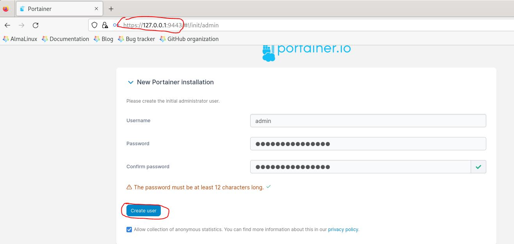
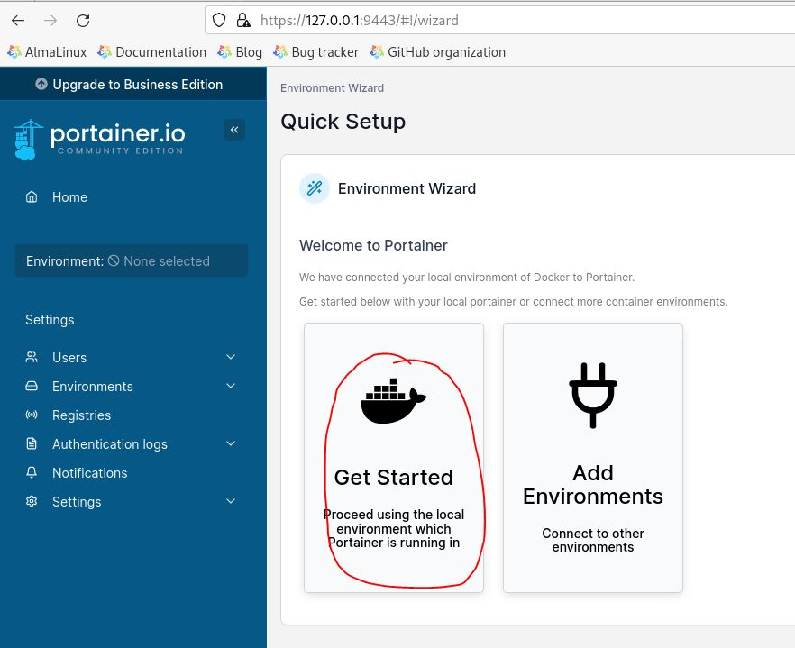
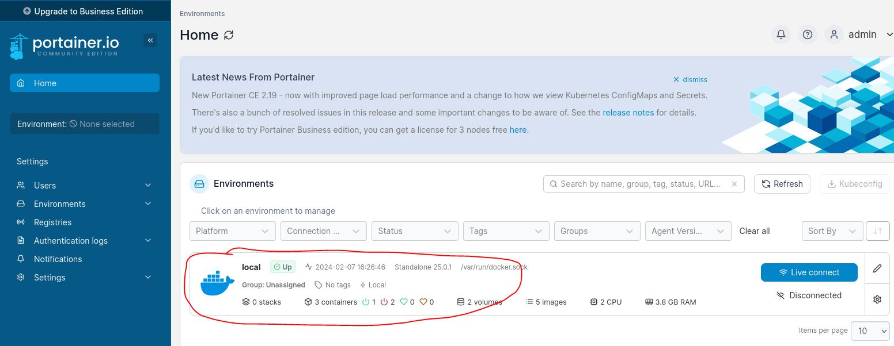
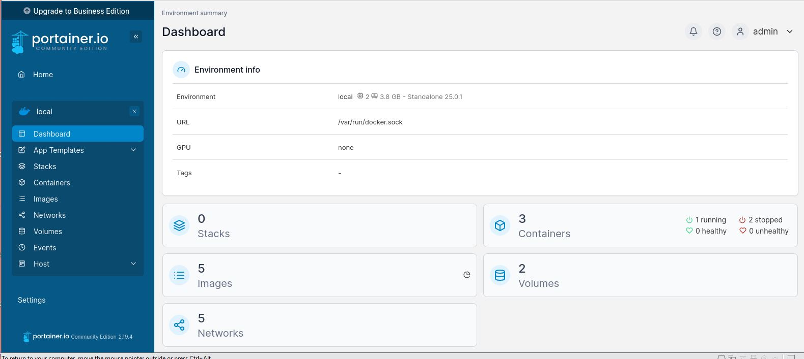

#### Installation 

```yaml
[root@earth ~]# docker volume create portainer_data
[root@earth ~]# docker run -d -p 8000:8000 -p 9443:9443 --name portainer --restart=always -v /var/run/docker.sock:/var/run/docker.sock -v portainer_data:/data portainer/portainer-ce:latest
[root@earth ~]# docker ps
CONTAINER ID   IMAGE                        COMMAND                  CREATED          STATUS PORTS                                                                                            NAMES
3429864b81db   portainer/portainer:latest   "/portainer"             27 seconds ago   Up 27 seconds   0.0.0.0:8000->8000/tcp, :::8000->8000/tcp, 0.0.0.0:9443->9443/tcp, :::9443->9443/tcp, 9000/tcp   portaoner
```








---
#### Reference:

https://docs.portainer.io/start/install-ce/server/docker/linux

https://docs.portainer.io/

